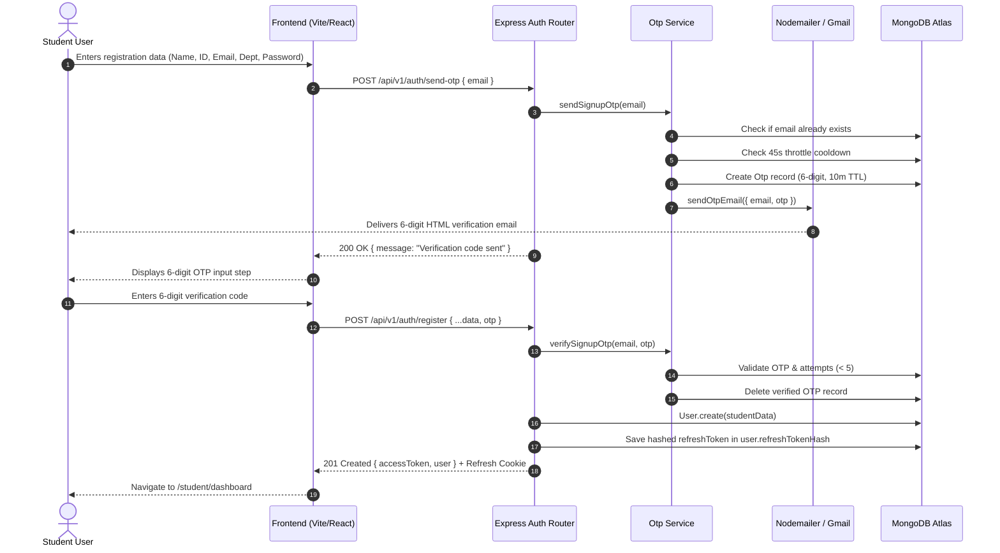
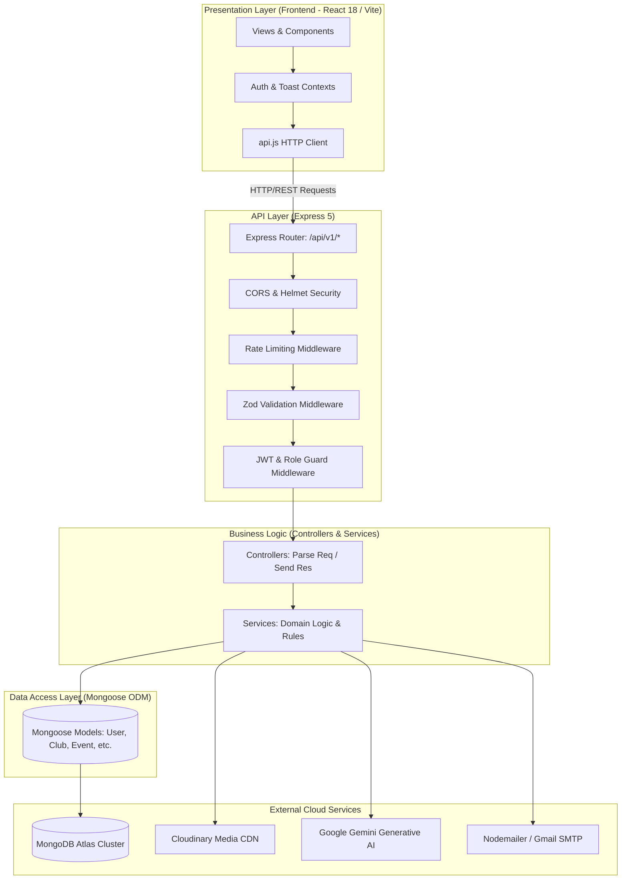
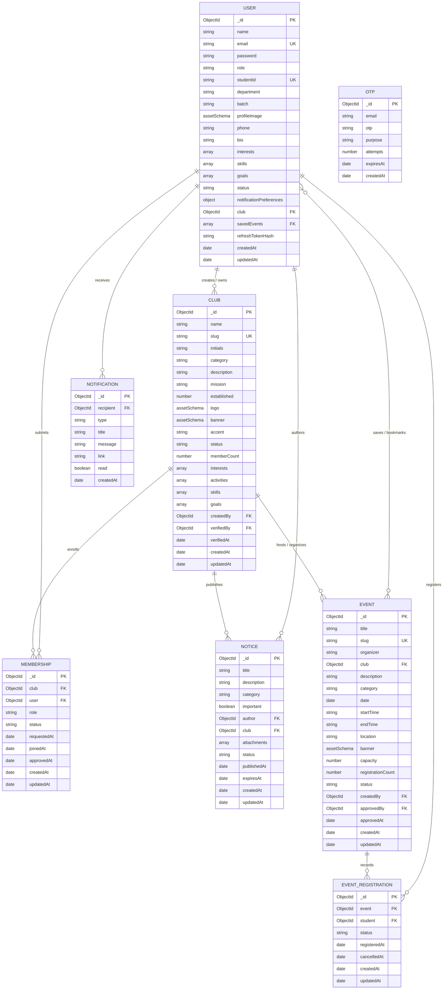
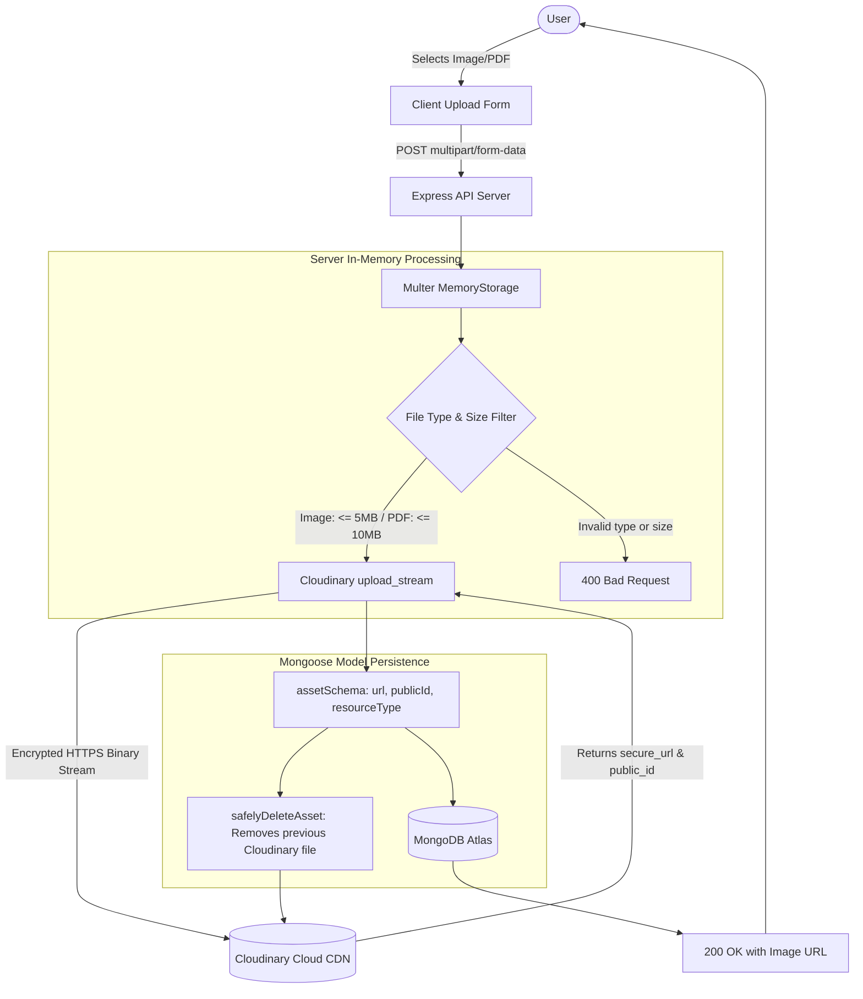
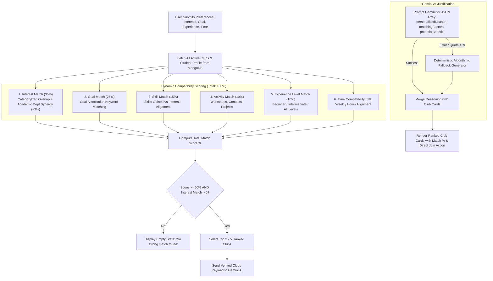
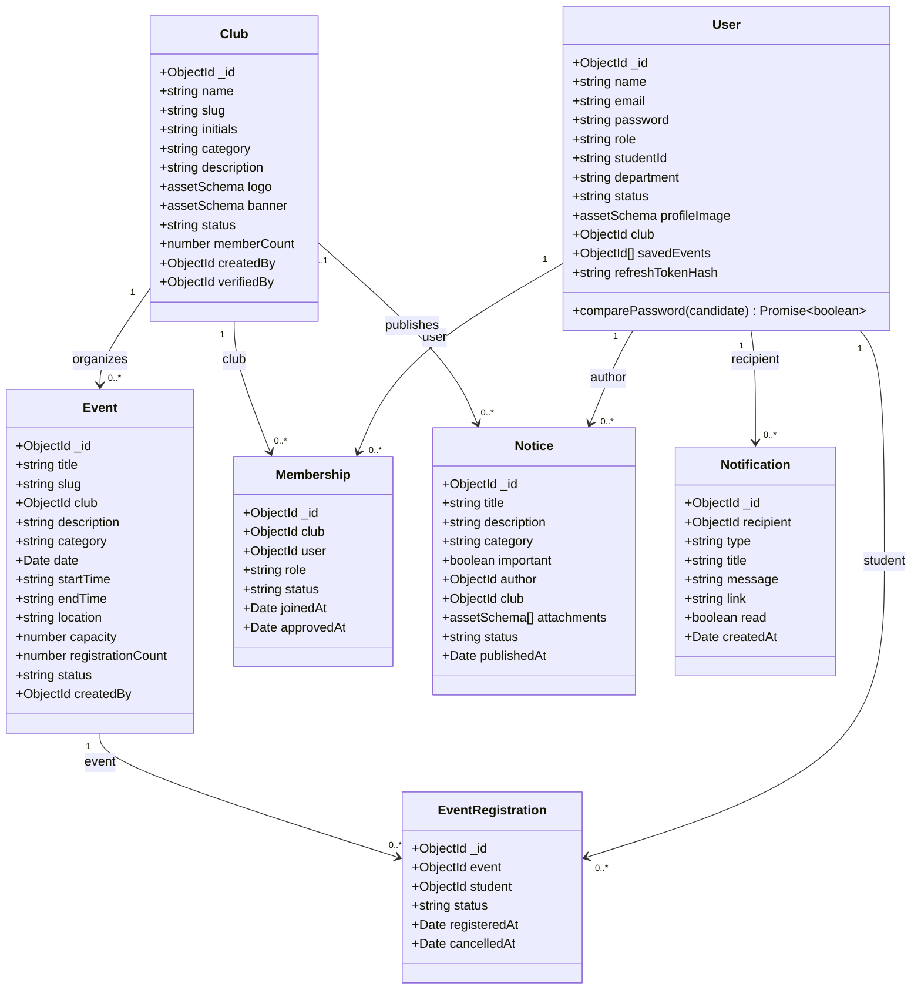

# CampusHub — Software Engineering & System Architecture Documentation

CampusHub is a unified, full-stack university campus management and student life platform. It bridges students, student-led organizations, and university administration into a single, cohesive, role-governed digital ecosystem.

Built with a **React 18 (Vite)** single-page application and a modular **Node.js / Express 5 RESTful API**, CampusHub is backed by **MongoDB Atlas** for multi-document ACID transactions, **Cloudinary** for scalable CDN media delivery, **Google Gemini Generative AI** for live-grounded campus assistance and club recommendations, and **Nodemailer** for email-verified onboarding.

---

## Table of Contents
1. [Project Overview](#1-project-overview)
2. [Project Features](#2-project-features)
3. [User Roles & Permissions](#3-user-roles--permissions)
4. [Authentication & Authorization](#4-authentication--authorization)
5. [Project File Structure](#5-project-file-structure)
6. [System Architecture](#6-system-architecture)
7. [System Components & Modules](#7-system-components--modules)
8. [Service Layer Architecture](#8-service-layer-architecture)
9. [Complete API Documentation](#9-complete-api-documentation)
10. [Database Design & Data Models](#10-database-design--data-models)
11. [Data Flow Workflows](#11-data-flow-workflows)
12. [External Cloud Integrations](#12-external-cloud-integrations)
13. [File Upload & Cloud Storage Pipeline](#13-file-upload--cloud-storage-pipeline)
14. [AI & Gemini Grounding Engine](#14-ai--gemini-grounding-engine)
15. [System Diagrams (Mermaid)](#15-system-diagrams-mermaid)
16. [Getting Started & Local Development](#16-getting-started--local-development)

---

## 1. Project Overview

### 1.1 Project Identification
- **Project Name:** CampusHub
- **Platform Type:** University Campus Management & Student Life Single-Page Application (SPA) with a RESTful Micro-monolith Backend.
- **Repository Structure:** Monorepo comprising a decoupled Express.js backend (`/Backend`) and a Vite + React frontend (`/Frontend`).

### 1.2 Purpose & Problem Statement
#### The Problem
In contemporary university environments, campus life is severely fragmented across disconnected channels:
- Event notices are scattered across social media groups, physical pinboards, and informal chat threads.
- Student clubs struggle with manual spreadsheets, unverified rosters, and lack of visibility.
- Event capacities cannot be enforced concurrently, causing either overbooking or empty halls.
- Administrators lack centralized oversight, automated audit trails for approvals, and real-time campus engagement statistics.
- Students lack an intelligent, personalized mechanism to discover clubs that match their academic department, specific goals, and weekly schedules.

#### The Proposed Solution: CampusHub
CampusHub provides a unified digital campus ecosystem:
1. **Centralized Hub:** Consolidated platform for university events, clubs, and administrative bulletins.
2. **Role-Enforced Workspaces:** Dedicated interfaces and permission boundaries for **Students**, **Club Organizers**, and **University Administrators**.
3. **Safe Event Ticketing & Capacity Locking:** Multi-document ACID database transactions guaranteeing zero oversubscription even under high concurrent traffic.
4. **Verified Student Onboarding:** Email-verified registration utilizing 6-digit Time-based OTPs sent via university email.
5. **AI Campus Intelligence & Club Recommender:** Integration with Google Gemini Generative AI backed by real-time MongoDB data queries to deliver verified campus answers and compatibility-scored club recommendations.
6. **Cloud Asset Pipeline:** Multi-tenant media management powered by Multer memory storage and Cloudinary CDN streaming.

### 1.3 Main Objectives
- Provide instantaneous, real-time discovery of campus activities with category filters, full-text search, and quick keyboard navigation (`⌘K` / `Ctrl+K`).
- Enforce strict server-side authorization and ownership validation across all club assets, events, and notices.
- Implement an automated administrative approval lifecycle (`pending` $\rightarrow$ `approved` / `rejected` / `published`) for clubs, events, and notices.
- Support student portfolio tracking with registered events, saved bookmarks, joined clubs, and direct profile customization.

### 1.4 Target Users & Environment
- **Target Users:** 
  1. *University Students:* Enrolled students exploring clubs, attending events, and tracking campus notices.
  2. *Club Executives / Organizers:* Student leaders managing organizations, creating events, posting notices, and curating rosters.
  3. *University Administrators:* Office of Student Affairs / IT personnel monitoring users, approving clubs and events, and issuing official bulletins.
- **Client Runtime Environment:** Modern evergreen web browsers (Chrome, Edge, Firefox, Safari) across desktop and mobile devices.
- **Server Runtime Environment:** Node.js runtime (v20+ LTS) in containerized or cloud PaaS environments (Render, Railway, AWS ECS).
- **Database Environment:** MongoDB Atlas (v7.0+ / v8.0+) with Replica Set support enabled for multi-document ACID transactions.

### 1.5 Technology Stack Summary

| Layer | Technology | Details / Implementation in Code |
| :--- | :--- | :--- |
| **Frontend Framework** | React 18+ (SPA) | Functional components, custom hooks, React Router v6 |
| **Frontend Build Tool** | Vite | `@vitejs/plugin-react`, ESM bundle optimization |
| **Styling & UI** | Vanilla CSS + Tailwind CSS | Custom dark-mode design system, glassmorphism, responsive grid |
| **Icons** | Lucide React | `lucide-react` iconography |
| **Backend Runtime** | Node.js (ES Modules) | `"type": "module"` in `Backend/package.json` |
| **Web Server Framework** | Express 5.2.1 | Routing, middleware chaining, centralized error handling |
| **Database** | MongoDB Atlas | Managed cluster with transactions, replica sets, connection pooling |
| **ODM / Data Modeling** | Mongoose 9.9.4 | Schemas, partial unique indexes, hooks, model transforms |
| **Validation** | Zod 4.4.3 | Strict request body, query, and parameter schema validation |
| **Authentication** | JWT (`jsonwebtoken` 9.0.3) | Dual-token: short-lived access JWT + rotated refresh JWT cookie |
| **Password Security** | `bcryptjs` 3.0.3 | 12-round salted hashing |
| **Email Verification** | `nodemailer` 9.0.6 | Gmail SMTP transporter sending 6-digit HTML verification codes |
| **File Storage** | Cloudinary v2 API | `cloudinary` 2.11.0, direct buffer streaming via `multer` memory storage |
| **Artificial Intelligence** | Google Gemini Generative AI | `@google/generative-ai` 0.24.1 (`gemini-3.5-flash-lite`, `gemini-flash-latest`) |
| **Security & Utilities** | Helmet, CORS, Rate Limiting | `helmet` 8.3.0, `cors` 2.8.6, `express-rate-limit` 8.6.2 |

---

## 2. Project Features

### Implemented Features

#### 1. Authentication & Security
- **Email OTP Verification for Registration:** Students enter personal and academic details, triggering a 6-digit OTP email valid for 10 minutes, throttled by a 45-second resend cooldown and 5-attempt brute-force lock.
- **Dual-Token JWT Authentication:** Issues a 15-minute access token in JSON response and sets a 7-day HTTP-only refresh token.
- **Token Rotation & Revocation:** Every refresh request verifies the SHA-256 hash of the refresh token stored in MongoDB and rotates the token; logging out revokes the hash immediately.
- **Role-Based Access Control (RBAC):** Middleware intercepts requests and strictly allows or rejects access based on `student`, `club`, or `admin` roles.
- **Password Reset Mechanism:** Time-limited (30-minute) cryptographically secure password reset token hashing.
- **Multi-Tier Rate Limiting:** Separate rate limits for general API routes (500 req/15 min), authentication routes (20 req/15 min), and AI services (60 req/15 min).

#### 2. User & Profile Management
- **Student Profile Customization:** Update name, department, batch, phone, bio, and academic interests/skills.
- **Cloudinary Avatar Uploads:** Direct in-memory file upload converting avatar images to Cloudinary assets with automatic deletion of previous avatar images.
- **Password Modification:** Secure in-app password changes requiring verification of the existing password.
- **Notification Preferences:** Toggles for email notifications, event reminders, and club updates.
- **Student Activity Dashboard:** Real-time aggregated stats of registered events, joined clubs, saved bookmarks, and unread notifications.

#### 3. Student Clubs & Organizations
- **Club Directory & Filtering:** Paginated browsing of approved clubs with category filtering, search, and sorting by name or creation date.
- **Club Detail Profiles:** Displays mission statements, leadership details, established date, member rosters, and active event calendars.
- **One-Click Club Membership:** Students can join approved clubs with transactional member count incrementation and notification dispatching.
- **Club Management Suite (Club Role):**
  - Club profile editor (description, mission, accent branding color, category).
  - Multi-file branding uploads (Logo and Banner) to Cloudinary.
  - Member management table: View members, filter by status, promote roles (`member`, `executive`, `president`), and remove members.
  - Organization dashboard with real-time membership counts, event metrics, and announcement feeds.
- **Admin Club Creation & Seeding:** Administrators can directly provision club accounts with associated executive credentials and auto-approval.

#### 4. Event Management & Safe Registration
- **Event Discovery:** Filter by category (`Technology`, `Cultural`, `Sports`, `Career`, `Workshop`, `Competition`), keyword search, and sorting (date, popularity, newest).
- **Concurrency-Safe Event Registration:** Uses atomic conditional MongoDB transactions (`$expr: { $or: [ { $eq: ['$capacity', null] }, { $lt: ['$registrationCount', '$capacity'] } ] }`) to prevent overbooking past capacity under concurrent requests.
- **Event Cancellation:** Students can cancel registrations, automatically decrementing the registration count within a database transaction.
- **Event Bookmarking:** Students can save/unsave events to their profile bookmark list.
- **Club Event Creator & Moderation:**
  - Clubs can draft or submit events with title, schedule, venue, capacity, and Cloudinary banner images.
  - Event status workflow: `draft` $\rightarrow$ `pending` $\rightarrow$ `published` (or `rejected` / `cancelled` / `ended`).
- **Participant Roster Export:** Club executives can inspect registered attendees and download/view full participant lists.

#### 5. Campus Notices & Bulletin Board
- **Categorized Announcements:** Notice classifications including `Academic`, `General`, `Club`, `Important`, and `Event`.
- **Notice Creation & Attachment Upload:** Support for uploading up to 5 image or PDF attachments (up to 10 MB per PDF) streamed directly to Cloudinary.
- **Priority Pinning & Expiry:** High-priority notices marked with `important: true`, plus expiration date filtering.

#### 6. Notifications & Global Search
- **Centralized Notification Engine:** Automated event registration confirmations, club membership notifications, and administrative moderation alerts.
- **Mark as Read / Mark All as Read:** Granular read-state tracking per notification.
- **Global `⌘K` Campus Search:** Unified real-time search modal querying events, clubs, and notices simultaneously.

#### 7. AI Campus Assistant & Club Recommender
- **CampusHub AI (Conversational Assistant):**
  - Powered by Google Gemini with multi-candidate fallback (`gemini-3.5-flash-lite`, `gemini-flash-latest`, `gemini-2.5-flash`).
  - **Live Database Injection:** Dynamic query resolution queries MongoDB in real-time to feed verified club lists, event counts, upcoming schedules, and notices into system instructions.
  - Non-sensitive academic context injection (Department, Batch, Student Name).
- **Club Recommender Engine:**
  - Multi-factor compatibility scoring formula:
    $$\text{Score} = \text{Interest (35\%)} + \text{Goal (25\%)} + \text{Skill (15\%)} + \text{Activity (10\%)} + \text{Experience (10\%)} + \text{Time (5\%)} + \text{Synergy Bonus}$$
  - Gemini AI provides personalized explanations and benefits for recommended clubs.
  - Deterministic fallback generator ensures recommendations function smoothly even if Gemini API quota is exhausted.

#### 8. Administrative Suite
- **Analytics & Trends:** Real-time user metrics, club statistics, event engagement numbers, and a 6-month monthly campus activity aggregation.
- **Unified Moderation Queue:** Centralized approvals tab for pending clubs, events, and notices with approve/reject actions and reason notifications.
- **User Lifecycle Management:** View all user profiles, toggle account status (`active` $\leftrightarrow$ `suspended`), and cascade-delete user records safely.
- **Club & Event Moderation:** Suspend or reactivate clubs; publish, reject, or archive events.

---

### Planned / Incomplete Features
- **Third-Party OAuth:** Google OAuth 2.0 integration (local JWT email/password authentication is fully implemented; OAuth is not yet wired).
- **QR Code Event Check-In:** Marking attendance status from `registered` $\rightarrow$ `attended` via physical venue check-in (the `attended` enum value is defined in statuses and models, but scanner UI is unbuilt).
- **Public Password Reset Link Delivery via Email:** Password reset generation and token validation are built in `auth.service.js`; however, transactional reset link email delivery is reserved for production deployment.

---

## 3. User Roles & Permissions

The CampusHub access control model strictly enforces three distinct roles: `student`, `club`, and `admin`.

```mermaid
graph TD
    classDef student fill:#1e293b,stroke:#38bdf8,stroke-width:2px,color:#f8fafc;
    classDef club fill:#1e293b,stroke:#f59e0b,stroke-width:2px,color:#f8fafc;
    classDef admin fill:#1e293b,stroke:#ef4444,stroke-width:2px,color:#f8fafc;

    User([Authenticated User])
    User -->|role: student| StudentRole[Student Workspace]:::student
    User -->|role: club| ClubRole[Club Organizer Workspace]:::club
    User -->|role: admin| AdminRole[Administrative Workspace]:::admin

    subgraph "Student Capabilities"
        StudentRole --> S1[Browse & Register for Events]
        StudentRole --> S2[Join Clubs & Explore Directory]
        StudentRole --> S3[AI Assistant & Club Recommender]
        StudentRole --> S4[Manage Profile, Avatar & Saved Events]
    end

    subgraph "Club Organizer Capabilities"
        ClubRole --> C1[Manage Associated Club Profile]
        ClubRole --> C2[Create & Manage Club Events]
        ClubRole --> C3[Post Club Notices & Attachments]
        ClubRole --> C4[Curate Member Roster & Roles]
    end

    subgraph "Admin Capabilities"
        AdminRole --> A1[Approve / Reject Clubs, Events, Notices]
        AdminRole --> A2[User Moderation & Account Suspension]
        AdminRole --> A3[System Analytics & 6-Month Trends]
        AdminRole --> A4[Seed New Organization Accounts]
    end
```



### Detailed Role Specifications

#### 1. Student (`student`)
- **Primary Responsibility:** Participate in campus community life, explore events, join organizations, and stay informed on university updates.
- **Permissions:** Read public/approved entities; create event registrations; create club memberships; manage own profile, avatar, passwords, notifications, and bookmark lists; utilize CampusHub AI assistant and recommendation tools.
- **Accessible Pages:**
  - `/student/dashboard`
  - `/student/events` & `/student/events/:id`
  - `/student/clubs` & `/student/clubs/:id`
  - `/student/notices`
  - `/student/profile` (includes AI Assistant & Recommender tabs)
  - `/student/notifications`
  - `/student/settings`
- **Accessible APIs:**
  - `GET /users/me`, `GET /users/me/dashboard`, `PUT /users/me`, `PATCH /users/me/password`, `POST /users/me/avatar`
  - `POST /clubs/:id/join`, `GET /clubs/my/joined`
  - `POST /events/:id/register`, `DELETE /events/:id/register`, `POST /events/:id/save`, `DELETE /events/:id/save`, `GET /events/my/registered`, `GET /events/my/saved`
  - `GET /notifications`, `PATCH /notifications/:id/read`, `PATCH /notifications/read-all`
  - `POST /ai/chat`, `POST /ai/club-recommendations`
- **Restrictions:** Cannot create clubs, cannot post university notices, cannot approve content, cannot view administrative metrics, cannot inspect participant rosters of other clubs.

#### 2. Club Organizer (`club`)
- **Primary Responsibility:** Represent an approved student club, publish and coordinate events, manage club public branding, and communicate with members.
- **Permissions:** Manage only the specific club tied to their account (`user.club` or `club.createdBy`); create/edit/delete events for their club; upload club logo/banner; post announcements with attachments; view and manage registered attendees.
- **Accessible Pages:**
  - `/club/dashboard`
  - `/club/profile`
  - `/club/events` & `/club/events/create`
  - `/club/announcements`
  - `/club/members`
  - `/club/settings`
- **Accessible APIs:**
  - `GET /clubs/:id/dashboard`, `PUT /clubs/:id`, `POST /clubs/:id/logo`, `POST /clubs/:id/banner`
  - `GET /clubs/:id/members`, `PATCH /clubs/:id/members/:memberId`, `DELETE /clubs/:id/members/:memberId`
  - `POST /events`, `PUT /events/:id`, `DELETE /events/:id`, `PATCH /events/:id/status`, `POST /events/:id/banner`, `GET /events/:id/registrations`
  - `POST /notices`, `PUT /notices/:id`, `DELETE /notices/:id`, `POST /notices/:id/attachments`
- **Restrictions:** Restricted strictly to resources owned by their club (enforced in `assertCanManage`); events and notices require administrative approval unless published in draft mode; cannot register as a participant; cannot alter user accounts.

#### 3. Administrator (`admin`)
- **Primary Responsibility:** Overall governance of the platform, user compliance, student organization accreditation, and publishing official university announcements.
- **Permissions:** Unrestricted access across all clubs, events, notices, and users; approve or reject pending submissions; suspend or activate user/club accounts; delete users with automatic data cascades; provision new verified clubs.
- **Accessible Pages:**
  - `/admin/dashboard`
  - `/admin/users`
  - `/admin/clubs`
  - `/admin/events`
  - `/admin/notices`
  - `/admin/approvals`
  - `/admin/settings`
- **Accessible APIs:**
  - `GET /admin/metrics`
  - `GET /admin/users`, `GET /admin/users/:id`, `PATCH /admin/users/:id/status`, `DELETE /admin/users/:id`
  - `GET /admin/approvals`, `POST /admin/approvals/:id/approve`, `POST /admin/approvals/:id/reject`
  - `POST /admin/clubs` (seed verified club), `PATCH /admin/clubs/:id/status`, `PATCH /admin/events/:id/status`
- **Restrictions:** Cannot suspend or delete their own admin account.

---

## 4. Authentication & Authorization

### 4.1 System Overview
CampusHub uses an enterprise-grade stateless authentication and token rotation architecture:
- **Password Protection:** Uses `bcryptjs` with 12 salt rounds. Passwords must be at least 8 characters long and contain both letters and digits.
- **Access Tokens:** Signed using `JWT_ACCESS_SECRET` with a default lifespan of 15 minutes (`ACCESS_TOKEN_EXPIRES_IN`). Transmitted via the `Authorization: Bearer <token>` header. Contains payload `{ sub: user._id, role: user.role, type: 'access' }`.
- **Refresh Tokens:** Signed using `JWT_REFRESH_SECRET` with a 7-day lifespan (`REFRESH_TOKEN_EXPIRES_IN`). Generated with a unique UUID (`jti`). Stored in an HTTP-only, SameSite cookie and/or synchronized via the client refresh fallback.
- **Database Refresh Session Hashing:** The backend computes a SHA-256 cryptographic hash of the refresh token (`hashToken(refreshToken)`) and saves it to `user.refreshTokenHash`. When refreshing, the incoming token's hash is compared against the stored database hash.
- **Account Suspension Guard:** Every protected request re-queries the user in `auth.middleware.js`; if `user.status === 'suspended'`, access is rejected with `403 Forbidden` instantly.

### 4.2 Registration & Verification Flow



### 4.3 Login & Token Rotation Flow

```mermaid
sequenceDiagram
    autonumber
    actor User as User
    participant Client as Frontend (React App)
    participant API as Backend (Express API)
    participant DB as MongoDB Atlas

    User->>Client: Submit email & password
    Client->>API: POST /api/v1/auth/login
    API->>DB: User.findOne({ email }).select('+password +refreshTokenHash')
    API->>API: bcrypt.compare(password, user.password)
    alt Invalid Credentials or Suspended
        API-->>Client: 401 Unauthorized / 403 Suspended
    else Valid Credentials
        API->>API: signAccessToken(user) [15m]
        API->>API: signRefreshToken(user) [7d]
        API->>DB: user.refreshTokenHash = sha256(refreshToken)
        API-->>Client: 200 OK { accessToken, refreshToken, user } + Set-Cookie
        Client->>Client: Store accessToken in memory & localStorage
        Client-->>User: Redirect to Role Dashboard
    end

    Note over Client,API: Subsequent Authenticated Requests
    Client->>API: GET /api/v1/users/me (Header: Bearer accessToken)
    API->>API: jwt.verify(token, JWT_ACCESS_SECRET)
    API->>DB: User.findById(payload.sub)
    API-->>Client: 200 OK { user }

    Note over Client,API: Token Expiration (401) & Silent Refresh
    Client->>API: GET /api/v1/student/events (Expired Token)
    API-->>Client: 401 Unauthorized (Token has expired)
    Client->>API: POST /api/v1/auth/refresh { refreshToken }
    API->>API: verifyRefreshToken(token, JWT_REFRESH_SECRET)
    API->>DB: Find user & compare sha256(token) === user.refreshTokenHash
    API->>API: Generate new Access Token & new Refresh Token (Rotation)
    API->>DB: Update user.refreshTokenHash = sha256(newRefreshToken)
    API-->>Client: 200 OK { newAccessToken, newRefreshToken }
    Client->>API: Re-fetch original request with newAccessToken
    API-->>Client: 200 OK { events }
```



---

## 5. Project File Structure

```
d:/CampusHub/
├── .env                             # Environment configuration (ignored in git)
├── .env.example                     # Reference environment variables
├── .gitignore                       # Git ignore configuration
├── frontend.md                      # Frontend architecture overview
├── uploads/                         # Local static upload storage (fallback)
│
├── Backend/                         # Express REST API Server
│   ├── eslint.config.js             # ESLint configuration
│   ├── package.json                 # Backend dependencies & npm scripts
│   ├── package-lock.json
│   ├── README.md                    # Backend operational documentation
│   ├── vitest.config.js             # Vitest test runner configuration
│   ├── scripts/                     # Build, seed, and integration scripts
│   │   ├── build.js                 # Syntax and dependency validation script
│   │   └── integration-test.js      # Transactional test suite against MongoDB
│   ├── tests/                       # Unit and integration test suites
│   │   ├── setup.js
│   │   ├── unit/                    # Isolated tests (no database required)
│   │   └── integration/             # Integration tests
│   └── src/                         # Backend source code
│       ├── app.js                   # Express app factory, middleware pipeline
│       ├── server.js                # Server entry point, graceful shutdown
│       ├── config/                  # External service & runtime configurations
│       │   ├── cloudinary.js        # Cloudinary SDK initialization
│       │   ├── cors.js              # Origin & credentialed CORS policy
│       │   ├── database.js          # Mongoose connection & DNS servers
│       │   └── env.js               # Zod-validated environment config
│       ├── constants/               # System enums and constants
│       │   ├── roles.js             # User roles ('student', 'club', 'admin')
│       │   └── statuses.js          # Club, event, membership & notice statuses
│       ├── controllers/             # HTTP route controllers
│       │   ├── admin.controller.js
│       │   ├── ai.controller.js
│       │   ├── auth.controller.js
│       │   ├── club.controller.js
│       │   ├── event.controller.js
│       │   ├── health.controller.js
│       │   ├── notice.controller.js
│       │   ├── notification.controller.js
│       │   ├── search.controller.js
│       │   └── user.controller.js
│       ├── database/
│       │   └── seed.js              # Development database seed script
│       ├── middleware/              # Express middlewares
│       │   ├── auth.middleware.js   # JWT authentication & user resolution
│       │   ├── error.middleware.js  # Centralized error handler
│       │   ├── notFound.middleware.js # 404 handler
│       │   ├── rateLimit.middleware.js # Rate limiters (API, Auth, AI)
│       │   ├── role.middleware.js   # RBAC permission check
│       │   ├── upload.middleware.js # Multer in-memory upload configurations
│       │   └── validation.middleware.js # Zod schema validator middleware
│       ├── models/                  # Mongoose schemas & data models
│       │   ├── shared.js            # Reusable assetSchema & cleanJson transform
│       │   ├── User.js              # User schema & password hashing hooks
│       │   ├── Club.js              # Club schema, slugs, branding assets
│       │   ├── Event.js             # Event schema, capacity & schedules
│       │   ├── EventRegistration.js # Student event attendance tracking
│       │   ├── Membership.js        # Club member roles & join requests
│       │   ├── Notice.js            # Campus notice bulletins & attachments
│       │   ├── Notification.js      # User notification alerts
│       │   └── Otp.js               # Signup/Reset 6-digit OTPs with TTL
│       ├── routes/                  # Express route declarations
│       │   ├── index.js             # Root v1 router aggregator
│       │   ├── admin.routes.js
│       │   ├── ai.routes.js
│       │   ├── auth.routes.js
│       │   ├── club.routes.js
│       │   ├── event.routes.js
│       │   ├── notice.routes.js
│       │   ├── notification.routes.js
│       │   ├── search.routes.js
│       │   └── user.routes.js
│       ├── services/                # Business logic & external integrations
│       │   ├── admin.service.js     # Moderation queues & metric aggregation
│       │   ├── ai.service.js        # Google Gemini AI chat orchestration
│       │   ├── auth.service.js      # User registration, login, token rotation
│       │   ├── campusData.service.js # Live MongoDB query tools for Gemini
│       │   ├── cloudinary.service.js# In-memory buffer streaming & deletion
│       │   ├── club.service.js      # Club CRUD, joins, and memberships
│       │   ├── clubRecommender.service.js # Multi-factor recommendation algorithm
│       │   ├── email.service.js     # Nodemailer Gmail SMTP email dispatch
│       │   ├── event.service.js     # Event operations & transactional registrations
│       │   ├── notice.service.js    # Notices, attachments & bulletin queries
│       │   ├── notification.service.js # Notification creation & read state
│       │   ├── otp.service.js       # OTP generation, throttling & verification
│       │   ├── search.service.js    # Global full-text multi-collection search
│       │   └── user.service.js      # Profile management & student dashboard data
│       ├── utils/                   # Shared utility helpers
│       │   ├── ApiError.js          # Custom operational error class
│       │   ├── ApiResponse.js       # Standardized response helper
│       │   ├── asyncHandler.js      # Async controller wrapper
│       │   ├── jwt.js               # JWT signing, verification & SHA-256 hashing
│       │   ├── pagination.js        # Pagination offset & metadata calculator
│       │   ├── password.js          # Bcrypt hashing & verification
│       │   ├── request.js           # Request parameter sanitation
│       │   └── slug.js              # URL-friendly slug generator
│       └── validators/              # Zod validation schemas
│           ├── admin.validator.js
│           ├── ai.validator.js
│           ├── auth.validator.js
│           ├── club.validator.js
│           ├── common.validator.js
│           ├── event.validator.js
│           ├── notice.validator.js
│           └── user.validator.js
│
└── Frontend/                        # React Single-Page Application (Vite)
    ├── index.html                   # HTML entry document
    ├── package.json                 # Frontend dependencies & build scripts
    ├── postcss.config.js            # PostCSS configuration
    ├── tailwind.config.js           # Tailwind utilities & token extensions
    ├── vite.config.js               # Vite bundler configuration & proxies
    └── src/
        ├── App.jsx                  # Root React component
        ├── main.jsx                 # DOM bootstrap & Context Provider tree
        ├── index.css                # Obsidian glassmorphic design system tokens
        ├── components/
        │   ├── ai/
        │   │   ├── CampusHubAI.jsx  # AI Campus Assistant conversational UI
        │   │   └── ClubRecommender.jsx # Multi-step recommendation questionnaire
        │   ├── clubs/
        │   │   ├── ClubCard.jsx
        │   │   └── ClubGrid.jsx
        │   ├── common/
        │   │   ├── Avatar.jsx
        │   │   ├── Badge.jsx
        │   │   ├── Button.jsx
        │   │   ├── ConfirmDialog.jsx
        │   │   ├── DatePicker.jsx
        │   │   ├── EmptyState.jsx
        │   │   ├── Input.jsx
        │   │   ├── LoadingState.jsx
        │   │   ├── Modal.jsx
        │   │   ├── SearchBar.jsx
        │   │   ├── TimePicker.jsx
        │   │   └── Toast.jsx
        │   ├── dashboard/
        │   │   └── StatCard.jsx
        │   ├── events/
        │   │   ├── EventCard.jsx
        │   │   └── EventGrid.jsx
        │   ├── layout/
        │   │   ├── DashboardLayout.jsx # Role-aware dashboard shell with sidebar
        │   │   ├── Footer.jsx
        │   │   ├── GlobalSearch.jsx # ⌘K instant search modal
        │   │   ├── Logo.jsx
        │   │   ├── Navbar.jsx
        │   │   └── PageHeader.jsx
        │   └── notices/
        │       ├── NoticeCard.jsx
        │       └── NoticeList.jsx
        ├── context/
        │   └── AuthContext.jsx      # Global user auth state, silent refresh
        ├── data/
        │   ├── departments.js       # Academic departments list
        │   └── mockData.js          # Development baseline mocks
        ├── hooks/
        │   ├── useApi.js            # Declarative data fetching & mutation hook
        │   └── useAuth.js           # Consumer hook for AuthContext
        ├── pages/
        │   ├── NotFound.jsx         # 404 and 403 route boundary views
        │   ├── admin/
        │   │   └── AdminPages.jsx   # Admin views: Dashboard, Users, Clubs, Events, Approvals
        │   ├── club/
        │   │   └── ClubPages.jsx    # Club views: Dashboard, Profile, Events, Members, Notices
        │   ├── public/
        │   │   ├── AuthPages.jsx    # Login, OTP Register, Forgot Password
        │   │   ├── Landing.jsx      # Marketing showcase & public hero
        │   │   └── PublicBrowse.jsx # Public browse for events, clubs, notices
        │   └── student/
        │       └── StudentPages.jsx # Student views: Dashboard, Events, Clubs, Profile, Settings
        ├── routes/
        │   └── AppRoutes.jsx        # Routing configuration & Guard components
        ├── services/
        │   └── api.js               # Fetch wrapper with interceptors & auto-refresh
        └── utils/
            └── eventStatus.js       # Automated date-time event status resolver
```

---

## 6. System Architecture



- **Presentation Layer:** Built with React 18 functional components and hooks. Manages UI layout, local state, responsive viewports, and interactive dialogs. Uses `AuthContext.jsx` to maintain authentication state in client memory and handle automatic token refresh.
- **API & Middleware Layer:** Express 5 pipeline mounted at `/api/v1`. Intercepts incoming requests with Helmet security headers, CORS origin verification, IP-based rate limiting, Zod schema validation, and JWT verification.
- **Controller Layer:** Thin, declarative handlers wrapped in `asyncHandler.js` that extract validated parameters (`req.validated`, `req.user`, `req.files`), invoke the corresponding service, and return standardized JSON via `ApiResponse.js`.
- **Service Layer:** Houses the core business logic. Enforces access permissions, validates state machines, starts database transactions, computes recommendation vectors, and interacts with third-party APIs.
- **Data Access Layer:** Mongoose models representing MongoDB collections. Encapsulates document schemas, partial indexes, text indexes, custom validation rules, and JSON serialization transforms.

---

## 7. System Components & Modules

### 1. Authentication & Security Module
- **Purpose:** Manages identity verification, registration, OTP delivery, session issuance, and token rotation.
- **Input:** User credentials, registration data, OTP verification codes, refresh tokens.
- **Processing:** Bcrypt password comparison, crypto-random OTP generation, JWT signing, SHA-256 token hashing, token verification.
- **Output:** JSON Web Tokens (Access), HTTP-only cookies (Refresh), sanitized user profiles.
- **Dependencies:** `jsonwebtoken`, `bcryptjs`, `User` model, `Otp` model, `nodemailer`.

### 2. User & Profile Module
- **Purpose:** Student identity, academic department data, password changes, and dashboard aggregation.
- **Input:** Profile updates, avatar image buffers, old/new passwords.
- **Processing:** Mongoose document updates, Cloudinary buffer upload, password verification, multi-collection dashboard metric aggregation.
- **Output:** Updated user documents, profile image URLs, dashboard statistics.
- **Dependencies:** `User`, `Event`, `Club`, `Notice`, `Notification`, `cloudinary.service.js`.

### 3. Club & Organization Module
- **Purpose:** Student organization management, public club directories, membership rosters, and club branding.
- **Input:** Club profile creation data, logo/banner image buffers, member update payloads.
- **Processing:** Unique slug generation, Cloudinary asset uploads, transactional member joins and status updates, notification generation.
- **Output:** Club profiles, membership records, member rosters, organization analytics.
- **Dependencies:** `Club`, `Membership`, `User`, `cloudinary.service.js`, `notification.service.js`.

### 4. Event Management Module
- **Purpose:** Campus event creation, scheduling, discovery, capacity control, and attendee registration.
- **Input:** Event creation payloads, category/date filters, registration requests.
- **Processing:** Slugs, date validation, atomic capacity-checking transactions (`$inc: { registrationCount: 1 }`), cancellation rollbacks.
- **Output:** Event documents, registration tickets, participant lists, capacity alerts.
- **Dependencies:** `Event`, `EventRegistration`, `Club`, `User`, `notification.service.js`.

### 5. Campus Notices Module
- **Purpose:** Official bulletins, academic announcements, and multi-file document attachments.
- **Input:** Notice headlines, body text, priority flags, image/PDF attachments.
- **Processing:** Category validation, Multer attachment parsing, Cloudinary raw/image streaming, expiration date filtering.
- **Output:** Notice records with attachment download/preview URLs.
- **Dependencies:** `Notice`, `Club`, `User`, `cloudinary.service.js`.

### 6. Notification Engine
- **Purpose:** Dispatches in-app alerts to users for events, club approvals, memberships, and admin moderation.
- **Input:** Recipient ID, notification type, title, message text, action link.
- **Processing:** Database document creation with read states; query filtering by user.
- **Output:** Unread counts, notification list items.
- **Dependencies:** `Notification` model.

### 7. Global Search Module
- **Purpose:** High-speed multi-entity campus search accessible across the application.
- **Input:** Query search string `q`.
- **Processing:** Case-insensitive regex and text queries executing simultaneously across Events, Clubs, and Notices collections.
- **Output:** Grouped search results categorized by entity type.
- **Dependencies:** `Event`, `Club`, `Notice`.

### 8. AI Campus Assistant Module (`CampusHub AI`)
- **Purpose:** Intelligent conversational campus advisor answering student questions about university life, events, clubs, and platform features.
- **Input:** Student message string, conversation history array.
- **Processing:** Dynamic intent parsing via `resolveCampusData`, live MongoDB queries (live club counts, upcoming event lists, notices), prompt construction with non-sensitive student profile facts, Google Gemini API execution with fallback.
- **Output:** Markdown-formatted conversational response with verified campus facts.
- **Dependencies:** `@google/generative-ai`, `campusData.service.js`, `User`.

### 9. Club Recommender Module (`Find Clubs For Me`)
- **Purpose:** Algorithmic matching of students to registered campus clubs based on personal and academic criteria.
- **Input:** Selected interests, primary goal, experience level, weekly time availability.
- **Processing:** Multi-factor scoring algorithm (interests 35%, goals 25%, skills 15%, activities 10%, experience 10%, time 5%), Gemini AI personalized justification generation, deterministic fallback generator.
- **Output:** Ranked list of recommended clubs with compatibility percentages, personalized reasons, matching factors, and potential benefits.
- **Dependencies:** `Club`, `User`, `clubRecommender.service.js`, `@google/generative-ai`.

### 10. Admin & Moderation Module
- **Purpose:** Platform compliance, system health metrics, approval queues, account suspension, and verified club provisioning.
- **Input:** Approval/rejection decisions, account status updates, deletion commands, club provisioning parameters.
- **Processing:** Status updates across models, transactional cascade deletions (cleaning up registrations, memberships, notifications, and Cloudinary assets), 6-month historical activity trend aggregation.
- **Output:** System metrics, review queues, updated resource statuses.
- **Dependencies:** All models, `cloudinary.service.js`, `notification.service.js`.

---

## 8. Service Layer Architecture

| Service | File | Primary Responsibilities | DB Interaction |
| :--- | :--- | :--- | :--- |
| `auth.service.js` | `Backend/src/services/auth.service.js` | Registration with OTP, login, refresh rotation, logout, password reset | `User`, `Club` |
| `otp.service.js` | `Backend/src/services/otp.service.js` | 6-digit OTP generation, 45s resend throttling, 5-attempt locking, TTL expiry | `Otp`, `User` |
| `email.service.js` | `Backend/src/services/email.service.js` | HTML verification email delivery via Gmail SMTP transporter | None (Nodemailer) |
| `user.service.js` | `Backend/src/services/user.service.js` | Student profile updating, password changes, avatar uploads, dashboard metrics | `User`, `Event`, `Club`, `Notice`, `Notification` |
| `club.service.js` | `Backend/src/services/club.service.js` | Club CRUD, slug generation, transactional join, member roster, asset upload | `Club`, `Membership`, `Event`, `Notice`, `User` |
| `event.service.js` | `Backend/src/services/event.service.js` | Event CRUD, transactional capacity registration, cancellation, bookmarks | `Event`, `EventRegistration`, `Club`, `User` |
| `notice.service.js` | `Backend/src/services/notice.service.js` | Campus bulletins, attachment streaming (PDF/image), priority tagging | `Notice`, `Club` |
| `notification.service.js`| `Backend/src/services/notification.service.js`| Create alerts, paginated listings, mark-as-read updates | `Notification` |
| `admin.service.js` | `Backend/src/services/admin.service.js` | System metrics, approvals, user status toggle, cascade user deletion, club seed | All models |
| `search.service.js` | `Backend/src/services/search.service.js` | Global regex text search across Events, Clubs, and Notices | `Event`, `Club`, `Notice` |
| `cloudinary.service.js` | `Backend/src/services/cloudinary.service.js` | In-memory Multer buffer streaming to Cloudinary CDN, safe asset deletion | None (Cloudinary v2 API) |
| `ai.service.js` | `Backend/src/services/ai.service.js` | Google Gemini AI assistant orchestration with live MongoDB context | `@google/generative-ai` |
| `campusData.service.js`| `Backend/src/services/campusData.service.js`| Live DB querying of clubs, events, and notices for Gemini injection | `Club`, `Event`, `Notice`, `Membership` |
| `clubRecommender.service.js`| `Backend/src/services/clubRecommender.service.js`| Multi-dimensional matching formula, Gemini justifications, fallback | `Club`, `User` |

---

## 9. Complete API Documentation

All routes use `/api/v1` (also aliased at `/api`).

| Method | Endpoint | Purpose | Authentication | Role Required | Request Body / Query | Success Response Format |
| :--- | :--- | :--- | :--- | :--- | :--- | :--- |
| **GET** | `/health` | Health & DB connection check | Public | None | None | `{ success: true, message: "CampusHub API is healthy", data: { status, database, environment } }` |
| **POST** | `/auth/send-otp` | Request 6-digit signup OTP | Public (Rate Limited) | None | `{ email: string }` | `{ success: true, message: "Verification code sent to your email" }` |
| **POST** | `/auth/register` | Register new student account | Public (Rate Limited) | None | `{ name, email, password, studentId, department, batch?, otp }` | `{ success: true, message: "Registration successful", data: { user, accessToken, refreshToken } }` |
| **POST** | `/auth/login` | Sign in with email & password | Public (Rate Limited) | None | `{ email, password }` | `{ success: true, message: "Login successful", data: { user, accessToken, refreshToken } }` |
| **POST** | `/auth/refresh` | Rotate access & refresh token | Public | None | `{ refreshToken? }` (or cookie) | `{ success: true, message: "Token refreshed successfully", data: { accessToken, refreshToken, user } }` |
| **POST** | `/auth/logout` | Invalidate refresh token session | Public | None | `{ refreshToken? }` (or cookie) | `{ success: true, message: "Logged out successfully" }` |
| **GET** | `/auth/me` | Fetch currently authenticated user | Bearer Token | Any | None | `{ success: true, data: user }` |
| **POST** | `/auth/forgot-password` | Request password reset token | Public (Rate Limited) | None | `{ email }` | `{ success: true, message: "If that email exists...", data: { resetToken? } }` |
| **POST** | `/auth/reset-password` | Complete password reset | Public (Rate Limited) | None | `{ token, password }` | `{ success: true, message: "Password reset successful" }` |
| **GET** | `/users/me` | Get personal user profile | Bearer Token | Any | None | `{ success: true, data: user }` |
| **GET** | `/users/me/dashboard` | Aggregated student dashboard data | Bearer Token | `student` | None | `{ success: true, data: { stats, featuredEvent, notices, clubs, events } }` |
| **PUT** | `/users/me` | Update student profile fields | Bearer Token | Any | `{ name?, department?, batch?, phone?, bio?, notificationPreferences? }` | `{ success: true, message: "Profile updated successfully", data: user }` |
| **PATCH** | `/users/me/password` | Change account password | Bearer Token | Any | `{ currentPassword, newPassword }` | `{ success: true, message: "Password updated successfully" }` |
| **POST** | `/users/me/avatar` | Upload profile avatar to Cloudinary | Bearer Token | Any | `multipart/form-data` (`avatar` or `image`) | `{ success: true, message: "Avatar updated successfully", data: user }` |
| **GET** | `/clubs` | Paginated clubs listing | Optional Token | Any | Query: `page`, `limit`, `category`, `search`, `status`, `sort` | `{ success: true, data: { items: Club[], pagination } }` |
| **POST** | `/clubs` | Register a new club | Bearer Token | `club`, `admin` | `{ name, initials, category, description, mission?, established?, accent? }` | `{ success: true, message: "Club created successfully", data: club }` |
| **GET** | `/clubs/:id` | Get club details by ID or slug | Optional Token | Any | Params: `id` | `{ success: true, data: { ...club, isMember, isPending, membershipRole } }` |
| **PUT** | `/clubs/:id` | Update club profile information | Bearer Token | `club`, `admin` | `{ name?, description?, mission?, category?, accent?, ... }` | `{ success: true, message: "Club updated successfully", data: club }` |
| **DELETE** | `/clubs/:id` | Delete club & cascade assets | Bearer Token | `club`, `admin` | Params: `id` | `{ success: true, message: "Club deleted successfully" }` |
| **GET** | `/clubs/:id/dashboard` | Organization dashboard metrics | Bearer Token | `club`, `admin` | Params: `id` | `{ success: true, data: { club, metrics, events, recentMembers, recentNotices } }` |
| **POST** | `/clubs/:id/join` | Join club as student member | Bearer Token | `student` | Params: `id` | `{ success: true, message: "Joined club successfully", data: membership }` |
| **GET** | `/clubs/:id/members` | Get club member roster | Bearer Token | `club`, `admin` | Params: `id`; Query: `page`, `limit`, `status` | `{ success: true, data: { items: Membership[], pagination } }` |
| **PATCH** | `/clubs/:id/members/:memberId`| Update member role or status | Bearer Token | `club`, `admin` | `{ role?: 'member'\|'executive'\|'president', status?: 'approved'\|'removed' }` | `{ success: true, message: "Membership updated successfully", data: membership }` |
| **DELETE** | `/clubs/:id/members/:memberId`| Remove member from club | Bearer Token | `club`, `admin` | Params: `id`, `memberId` | `{ success: true, message: "Member removed successfully" }` |
| **POST** | `/clubs/:id/logo` | Upload club logo to Cloudinary | Bearer Token | `club`, `admin` | `multipart/form-data` (`logo` or `image`) | `{ success: true, message: "Logo updated successfully", data: club }` |
| **POST** | `/clubs/:id/banner` | Upload club banner to Cloudinary | Bearer Token | `club`, `admin` | `multipart/form-data` (`banner` or `image`) | `{ success: true, message: "Banner updated successfully", data: club }` |
| **GET** | `/clubs/my/joined` | List student's joined clubs | Bearer Token | `student` | Query: `page`, `limit` | `{ success: true, data: { items: Club[], pagination } }` |
| **GET** | `/events` | Paginated events catalog | Optional Token | Any | Query: `page`, `limit`, `category`, `search`, `status`, `sort`, `mine` | `{ success: true, data: { items: Event[], pagination } }` |
| **POST** | `/events` | Create a new campus event | Bearer Token | `club`, `admin` | `{ title, description, category, date, startTime, endTime?, location, capacity?, status? }` | `{ success: true, message: "Event created successfully", data: event }` |
| **GET** | `/events/:id` | Get event details by ID or slug | Optional Token | Any | Params: `id` | `{ success: true, data: { ...event, isRegistered, isSaved } }` |
| **PUT** | `/events/:id` | Update event information | Bearer Token | `club`, `admin` | `{ title?, description?, category?, date?, startTime?, endTime?, location?, capacity? }` | `{ success: true, message: "Event updated successfully", data: event }` |
| **DELETE** | `/events/:id` | Delete event & cascade bookmarks | Bearer Token | `club`, `admin` | Params: `id` | `{ success: true, message: "Event deleted successfully" }` |
| **PATCH** | `/events/:id/status` | Modify event publication status | Bearer Token | `club`, `admin` | `{ status: 'draft'\|'pending'\|'published'\|'cancelled'\|'ended' }` | `{ success: true, message: "Event status updated successfully", data: event }` |
| **POST** | `/events/:id/register` | Register student for event (Capacity Guard) | Bearer Token | `student` | Params: `id` | `{ success: true, message: "Registered for event successfully", data: registration }` |
| **DELETE** | `/events/:id/register` | Cancel student event registration | Bearer Token | `student` | Params: `id` | `{ success: true, message: "Registration cancelled successfully" }` |
| **POST** | `/events/:id/save` | Bookmark event to student profile | Bearer Token | `student` | Params: `id` | `{ success: true, message: "Event saved successfully", data: { saved: true } }` |
| **DELETE** | `/events/:id/save` | Remove bookmark from profile | Bearer Token | `student` | Params: `id` | `{ success: true, message: "Event removed from saved", data: { saved: false } }` |
| **POST** | `/events/:id/banner` | Upload event banner to Cloudinary | Bearer Token | `club`, `admin` | `multipart/form-data` (`banner` or `image`) | `{ success: true, message: "Event banner updated successfully", data: event }` |
| **GET** | `/events/:id/registrations` | View attendee list for event | Bearer Token | `club`, `admin` | Params: `id`; Query: `status` | `{ success: true, data: { event, items: EventRegistration[], total } }` |
| **GET** | `/events/my/registered` | List student's registered events | Bearer Token | `student` | Query: `page`, `limit` | `{ success: true, data: { items: Event[], pagination } }` |
| **GET** | `/events/my/saved` | List student's saved bookmarks | Bearer Token | `student` | Query: `page`, `limit` | `{ success: true, data: { items: Event[], pagination } }` |
| **GET** | `/notices` | Paginated campus notices | Optional Token | Any | Query: `page`, `limit`, `category`, `important`, `search`, `status` | `{ success: true, data: { items: Notice[], pagination } }` |
| **POST** | `/notices` | Post a campus notice | Bearer Token | `club`, `admin` | `{ title, description, category, important?, status?, publishedAt? }` | `{ success: true, message: "Notice created successfully", data: notice }` |
| **GET** | `/notices/:id` | Get notice details | Optional Token | Any | Params: `id` | `{ success: true, data: notice }` |
| **PUT** | `/notices/:id` | Update notice details | Bearer Token | `club`, `admin` | `{ title?, description?, category?, important?, status? }` | `{ success: true, message: "Notice updated successfully", data: notice }` |
| **DELETE** | `/notices/:id` | Delete notice & Cloudinary files | Bearer Token | `club`, `admin` | Params: `id` | `{ success: true, message: "Notice deleted successfully" }` |
| **POST** | `/notices/:id/attachments` | Upload notice attachments (PDF/Images) | Bearer Token | `club`, `admin` | `multipart/form-data` (`attachments` or `files`, max 5) | `{ success: true, message: "Attachments uploaded successfully", data: notice }` |
| **GET** | `/notifications` | List user's notifications | Bearer Token | Any | Query: `page`, `limit` | `{ success: true, data: { items: Notification[], pagination } }` |
| **PATCH** | `/notifications/:id/read` | Mark single notification as read | Bearer Token | Any | Params: `id` | `{ success: true, message: "Notification marked as read", data: notification }` |
| **PATCH** | `/notifications/read-all` | Mark all notifications as read | Bearer Token | Any | None | `{ success: true, message: "All notifications marked as read", data: { updated: number } }` |
| **GET** | `/search` | Global multi-collection search | Public | None | Query: `q` | `{ success: true, data: { events: [], clubs: [], notices: [] } }` |
| **POST** | `/ai/chat` | Chat with CampusHub AI (Gemini) | Bearer Token (Rate Limited) | Any | `{ message: string, conversationHistory?: [] }` | `{ success: true, message: "Reply generated successfully", reply: string }` |
| **POST** | `/ai/club-recommendations`| Get AI club recommendations | Bearer Token (Rate Limited) | Any | `{ interests: string[], goal: string, experienceLevel?: string, availableTime?: string }` | `{ success: true, data: { recommendations: [], totalMatches: number, userPreferences: {} } }` |
| **GET** | `/admin/metrics` | Platform metrics & 6-month trends | Bearer Token | `admin` | None | `{ success: true, data: { users, activeUsers, clubs, events, registrations, activity: [] } }` |
| **GET** | `/admin/users` | List platform users with filters | Bearer Token | `admin` | Query: `page`, `limit`, `role`, `status`, `search`, `sort` | `{ success: true, data: { items: User[], pagination } }` |
| **GET** | `/admin/users/:id` | Inspect user details & counts | Bearer Token | `admin` | Params: `id` | `{ success: true, data: { ...user, registrationsCount, membershipsCount } }` |
| **PATCH** | `/admin/users/:id/status` | Activate or suspend user | Bearer Token | `admin` | `{ status: 'active' \| 'suspended' }` | `{ success: true, message: "User status updated successfully", data: user }` |
| **DELETE** | `/admin/users/:id` | Cascade delete user account | Bearer Token | `admin` | Params: `id` | `{ success: true, message: "User deleted successfully" }` |
| **GET** | `/admin/approvals` | Review queue of pending items | Bearer Token | `admin` | None | `{ success: true, data: { clubs: [], events: [], notices: [] } }` |
| **POST** | `/admin/approvals/:id/approve` | Approve pending submission | Bearer Token | `admin` | Params: `id`; Body: `{ type: 'club'\|'event'\|'notice', reason? }` | `{ success: true, message: "Approved successfully", data: resource }` |
| **POST** | `/admin/approvals/:id/reject` | Reject pending submission | Bearer Token | `admin` | Params: `id`; Body: `{ type: 'club'\|'event'\|'notice', reason? }` | `{ success: true, message: "Rejected successfully", data: resource }` |
| **POST** | `/admin/clubs` | Provision verified club & executive | Bearer Token | `admin` | `{ name, email, password, clubId, category?, established?, initials?, accent? }` | `{ success: true, message: "Club created and approved successfully", data: { user, club } }` |
| **PATCH** | `/admin/clubs/:id/status` | Change club status | Bearer Token | `admin` | `{ status: 'pending'\|'approved'\|'rejected'\|'suspended' }` | `{ success: true, message: "Club status updated successfully", data: club }` |
| **PATCH** | `/admin/events/:id/status` | Change event status | Bearer Token | `admin` | `{ status: 'draft'\|'pending'\|'published'\|'rejected'\|'cancelled'\|'ended' }` | `{ success: true, message: "Event status updated successfully", data: event }` |

---

## 10. Database Design & Data Models

### 10.1 Database Connection Configuration
- **Engine:** MongoDB Atlas (Cloud-hosted NoSQL document database).
- **Driver / ODM:** Mongoose 9.9.4.
- **Connection Logic:** Implemented in `database.js`. Public DNS resolvers (`8.8.8.8`, `8.8.4.4`, `1.1.1.1`) are injected into the Node.js DNS subsystem to ensure reliable SRV query lookup.
- **Transactions:** Multi-document operations use replica set sessions (`session.withTransaction`) to achieve ACID consistency.
- **JSON Serialization:** Schemas use a clean transformation hook in `shared.js` that strips `__v`, `password`, `refreshTokenHash`, `passwordResetTokenHash`, and `passwordResetExpiresAt` from API output.

### 10.2 Schemas & Data Models



---

## 11. Data Flow Workflows

### 11.1 Concurrency-Safe Event Registration Flow
When multiple students attempt to register for an event near maximum capacity simultaneously:
1. **Student Click:** Student clicks "Register" in `StudentEventDetails.jsx`.
2. **API Request:** Frontend issues `POST /api/v1/events/:id/register` with `Authorization: Bearer <accessToken>`.
3. **Middleware:** `authenticate` loads student document and verifies active status. `requireRole('student')` validates role.
4. **Transaction Initiation:** `event.service.js` opens a MongoDB transaction session via `mongoose.startSession()`.
5. **Pre-check:** `EventRegistration.exists({ event: eventId, student: studentId, status: { $in: ['registered', 'attended'] } })` verifies student is not already registered.
6. **Atomic Conditional Increment:**
   ```javascript
   const event = await Event.findOneAndUpdate(
     {
       _id: eventId,
       status: 'published',
       $expr: { $or: [{ $eq: ['$capacity', null] }, { $lt: ['$registrationCount', '$capacity'] }] },
     },
     { $inc: { registrationCount: 1 } },
     { new: true, session }
   )
   ```
7. **Condition Check:**
   - If `event` is null, capacity was reached concurrently or event is unpublished $\rightarrow$ Aborts transaction with `409 Conflict`.
   - If `event` is returned, capacity was safely reserved.
8. **Registration Upsert:** Creates or updates `EventRegistration` with `status: 'registered'`.
9. **Notification Dispatch:** Generates `Notification` document inside the transaction.
10. **Commit:** Commits transaction and returns `201 Created` with registration object.
11. **Client State Update:** Frontend updates registration status and increments capacity bar in UI.

---

## 12. External Cloud Integrations

| Service | Purpose | Configuration Location | Integration Mechanism | Data Sent | Data Received |
| :--- | :--- | :--- | :--- | :--- | :--- |
| **MongoDB Atlas** | Primary cloud database with replica set ACID transactions | Root `.env`: `MONGODB_URI` | Mongoose connection pool via `connectDatabase()` | Document queries, updates, aggregation pipelines, transaction sessions | Document results, write acknowledgments, cursor streams |
| **Cloudinary** | Cloud CDN image & PDF asset hosting | Root `.env`: `CLOUDINARY_CLOUD_NAME`, `CLOUDINARY_API_KEY`, `CLOUDINARY_API_SECRET` | Official Cloudinary v2 SDK `upload_stream` | In-memory binary file buffers from Multer | Secure HTTPS CDN URL, Cloudinary `public_id`, format, dimensions |
| **Google Gemini Generative AI** | AI Conversational Campus Assistant & Club Recommender | Root `.env`: `GEMINI_API_KEY`, `GEMINI_MODEL` (`gemini-3.5-flash-lite`) | `@google/generative-ai` SDK (`GoogleGenerativeAI`) | Structured prompt: System instructions, non-sensitive student profile, live MongoDB campus facts, conversation turns | Markdown text response / Structured JSON array of recommendations |
| **Nodemailer / Gmail** | Email delivery for 6-digit signup OTP verification | Root `.env`: `EMAIL_USER`, `EMAIL_PASS` (Gmail App Password) | `nodemailer.createTransport({ service: 'gmail' })` | Recipient email, subject line, responsive HTML email template with 6-digit code | SMTP message delivery acknowledgment, `messageId` |

---

## 13. File Upload & Cloud Storage Pipeline



1. **Client Selection:** User selects an avatar, event banner, club logo, or notice attachment.
2. **Multer Memory Buffer:** Files are kept in memory as buffers (`multer.memoryStorage()`) without touching disk.
3. **MIME & Size Enforcement:**
   - Images (`image/jpeg`, `image/png`, `image/webp`, `image/gif`): Capped at 5 MB.
   - Notice Attachments: Accepts images and `application/pdf` up to 10 MB per file, max 5 files.
4. **Cloudinary Direct Stream:** Creates an upload stream targeting the `campushub/<folder>` folder on Cloudinary.
5. **Asset Schema Persistence:** Cloudinary returns the secure URL and unique public ID, stored via `assetSchema` in MongoDB.
6. **Automatic Cleanup:** When updating an existing avatar, banner, or logo, or when deleting an event or club, `safelyDeleteAsset(previousAsset)` is invoked, calling `cloudinary.uploader.destroy()` to ensure storage hygiene.

---

## 14. AI & Gemini Grounding Engine

### 14.1 CampusHub AI (Conversational Assistant)
CampusHub AI is designed to act as an official university advisor with **direct, real-time access to the live MongoDB database**.

```mermaid
sequenceDiagram
    autonumber
    actor Student as Student User
    participant Frontend as React Chat UI (CampusHubAI)
    participant Controller as Express AI Controller
    participant CampusData as campusData.service.js
    participant DB as MongoDB Atlas
    participant Gemini as Google Gemini AI API

    Student->>Frontend: Enters message: "How many clubs are there and who leads CUET Robotics?"
    Frontend->>Controller: POST /api/v1/ai/chat { message, conversationHistory }
    Controller->>CampusData: resolveCampusData(message)
    
    rect rgb(30, 41, 59)
        Note over CampusData,DB: Live MongoDB Fact Resolution
        CampusData->>DB: Club.countDocuments({ status: { $ne: 'suspended' } })
        DB-->>CampusData: Count = 6
        CampusData->>DB: Club.findOne({ name: /Robotics/i }).populate('createdBy')
        DB-->>CampusData: Returns "CUET Robotics Society", Leader: "Arif Hasan"
        CampusData-->>Controller: Formatted Live DB Facts Block
    end

    Controller->>Controller: Build System Instruction (Student Dept/Batch + Live DB Facts)
    Controller->>Controller: Format history into alternating user/model turns
    Controller->>Gemini: model.generateContent({ contents, systemInstruction })
    Gemini-->>Controller: Returns verified Markdown response
    Controller-->>Frontend: 200 OK { reply: "..." }
    Frontend-->>Student: Renders formatted Markdown response with code blocks
```



### 14.2 AI Club Recommender Flow (`Find Clubs For Me`)
The club recommender pairs deterministic mathematical matching with Gemini explanation generation:



---

## 15. System Diagrams (Mermaid)

### 15.1 System Architecture Diagram
```mermaid
flowchart TB
    subgraph Client_Tier ["Client Tier (Browser)"]
        UserBrowser["User Browser (Desktop / Mobile)"]
        ReactApp["CampusHub React 18 SPA (Vite Bundler)"]
        UserBrowser <--> ReactApp
    end

    subgraph CDN_Gateway ["Gateway & Reverse Proxy Tier"]
        StaticHosting["Vite Static Server / Netlify / Vercel"]
        ExpressGateway["Express.js 5.2.1 Gateway Server (Node.js 20+)"]
        ReactApp -.->|Asset Requests| StaticHosting
        ReactApp <-->|Credentialed JSON / REST / Multipart| ExpressGateway
    end

    subgraph Middleware_Pipeline ["Express Middleware Pipeline"]
        CorsM["CORS & Origin Validation"]
        HelmetM["Helmet HTTP Security Headers"]
        RateM["Express Rate Limiters (API, Auth, AI)"]
        CookieM["Cookie Parser"]
        UploadM["Multer Memory Buffer Upload"]
        AuthM["JWT Authenticate & Role Middleware"]
        ValM["Zod Schema Validator"]

        ExpressGateway --> CorsM --> HelmetM --> RateM --> CookieM --> UploadM --> ValM --> AuthM
    end

    subgraph Service_Tier ["Service & Business Logic Tier"]
        AuthSvc["Auth Service"]
        UserSvc["User Service"]
        ClubSvc["Club Service"]
        EventSvc["Event Service"]
        NoticeSvc["Notice Service"]
        AdminSvc["Admin Service"]
        AISvc["AI Chat & Campus Data Service"]
        RecommenderSvc["Club Recommender Service"]
        CloudinarySvc["Cloudinary Service"]
        EmailSvc["Email Service"]

        AuthM --> AuthSvc & UserSvc & ClubSvc & EventSvc & NoticeSvc & AdminSvc & AISvc & RecommenderSvc
        UserSvc & ClubSvc & EventSvc & NoticeSvc --> CloudinarySvc
        AuthSvc --> EmailSvc
    end

    subgraph Data_Tier ["Data & External Cloud Tier"]
        MongoDB[(MongoDB Atlas Managed Replica Set)]
        CloudinaryCDN[(Cloudinary Media CDN)]
        GeminiAPI[(Google Gemini Generative AI)]
        GmailSMTP[(Gmail SMTP Server)]

        AuthSvc & UserSvc & ClubSvc & EventSvc & NoticeSvc & AdminSvc & AISvc & RecommenderSvc <-->|Mongoose ODM / Transactions| MongoDB
        CloudinarySvc <-->|Stream Buffer / Delete Asset| CloudinaryCDN
        AISvc & RecommenderSvc <-->|SDK REST API| GeminiAPI
        EmailSvc <-->|SMTP TLS (Port 465/587)| GmailSMTP
    end
```

### 15.2 UML Class Diagram


### 15.3 Deployment Diagram
```mermaid
flowchart TD
    subgraph Client_Environment ["Client Environment"]
        ClientDevice["User Terminal (PC / Laptop / Mobile Phone)"]
        BrowserApp["Web Browser (React SPA Bundle in Memory)"]
        ClientDevice --> BrowserApp
    end

    subgraph Cloud_Hosting ["Cloud Infrastructure"]
        subgraph Static_Hosting ["Frontend CDN Hosting (Vercel / Netlify / S3)"]
            ViteBundle["Static Assets (index.html, JS chunks, CSS, Icons)"]
        end

        subgraph Container_PaaS ["Backend PaaS (Render / Railway / AWS ECS)"]
            NodeServer["Node.js 20+ Runtime Container"]
            ExpressProcess["Express.js API Process (port: 5000)"]
            NodeServer --> ExpressProcess
        end

        subgraph Managed_DB ["Database Tier (MongoDB Atlas Cloud)"]
            AtlasPrimary[("Primary Replica (Read/Write)")]
            AtlasSecondary1[("Secondary Replica 1")]
            AtlasSecondary2[("Secondary Replica 2")]
            AtlasPrimary <--> AtlasSecondary1 & AtlasSecondary2
        end

        subgraph External_SaaS ["External SaaS Integrations"]
            CloudinaryCloud["Cloudinary Media Storage CDN"]
            GeminiCloud["Google Gemini AI Platform"]
            GmailCloud["Google Gmail SMTP Server"]
        end
    end

    BrowserApp <-->|HTTPS (Port 443)| ViteBundle
    BrowserApp <-->|HTTPS REST API / JSON| ExpressProcess
    ExpressProcess <-->|mongodb+srv:// TLS with SRV (Port 27017)| AtlasPrimary
    ExpressProcess <-->|HTTPS Multipart Buffer Stream| CloudinaryCloud
    ExpressProcess <-->|HTTPS REST SDK| GeminiCloud
    ExpressProcess <-->|SMTP TLS (Port 465 / 587)| GmailCloud
```

---

## 16. Getting Started & Local Development

### 16.1 Prerequisites
- **Node.js:** v20.0.0 or higher
- **Package Manager:** `npm` (v10+)
- **MongoDB Atlas:** Free cluster or local replica set
- **Cloudinary Account:** For image and document storage
- **Google Gemini API Key:** For CampusHub AI and Club Recommendations

### 16.2 Environment Configuration
Create a single `.env` file in the root `CampusHub/` directory (copied from `.env.example`):

```bash
NODE_ENV=development
PORT=5000

# MongoDB Connection
MONGODB_URI=mongodb+srv://<user>:<password>@cluster0.xxxxx.mongodb.net/campushub?retryWrites=true&w=majority

# JWT Signing Secrets (At least 32 random characters each)
JWT_ACCESS_SECRET=your_super_secret_jwt_access_key_min_32_characters_long
JWT_REFRESH_SECRET=your_super_secret_jwt_refresh_key_min_32_characters_long
ACCESS_TOKEN_EXPIRES_IN=15m
REFRESH_TOKEN_EXPIRES_IN=7d

# Cloudinary Storage Configuration
CLOUDINARY_CLOUD_NAME=your_cloudinary_cloud_name
CLOUDINARY_API_KEY=your_cloudinary_api_key
CLOUDINARY_API_SECRET=your_cloudinary_api_secret

# URLs & CORS
CLIENT_URL=http://localhost:5173
VITE_API_URL=http://localhost:5000/api/v1

# Development Seed Password
SEED_PASSWORD=your_seed_password_min_8_chars

# Email Service (Nodemailer Gmail SMTP)
EMAIL_USER=your_email@gmail.com
EMAIL_PASS=your_gmail_app_password

# Google Gemini AI Integration
GEMINI_API_KEY=your_gemini_api_key
GEMINI_MODEL=gemini-3.5-flash-lite
```

### 16.3 Installation & Startup

#### 1. Backend Setup
```bash
cd Backend
npm install
npm run seed     # Seeds development admin, clubs, students, events, and notices
npm run dev      # Starts Express API at http://localhost:5000
```

#### 2. Frontend Setup
```bash
cd Frontend
npm install
npm run dev      # Starts Vite dev server at http://localhost:5173
```

#### 3. Seeded Demo Accounts (Password: Value of `SEED_PASSWORD`)
- **Admin:** `admin@campushub.com`
- **Club Organizer (IEEE CS):** `club@campushub.local`
- **Club Organizer (Robotics):** `robotics@campushub.local`
- **Student:** `student@campushub.local`

---

*CampusHub — Architecture & System Engineering Specification. All rights reserved.*
